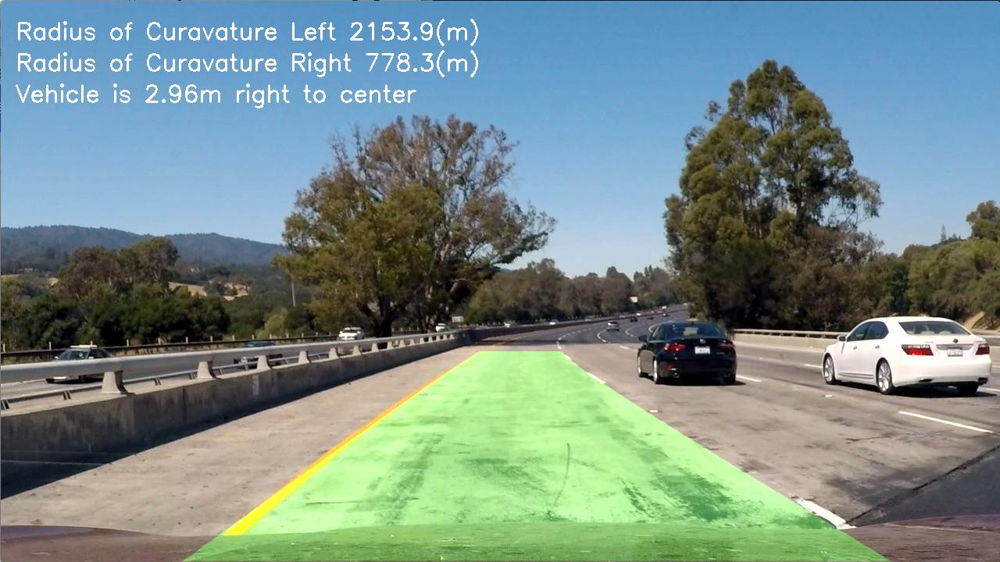

# Advanced Lane Finding

## Overview

---     

In this project, we have used the advanced lane line detection algorithm to detect the lane line over the [project_video](project_video.mp4). When compared to the [Basic Lane Finding](https://github.com/KoushikBMS/koushik-lane-finding) which is used in the previous project, we have overcame many shortcomings like distortion due to camera, curving roads and environmental challenges like shadows, lighting, etc.

To achive  the following steps has been followed,
* Computation of camera calibration matrix and distortion coefficients by using set of chessboard images in camera_cal folder.
* Applyed the distortion correction found from the camera calibaration step to raw images.
* Used color transforms and gradients to create a thresholded binary image.
* Applyed a perspective transform to over the binary image for getting "birds-eye view" of the image.
* using the slidding window to detect the lane lines on the perspective trasformed image and project the lane lines.
* Radius of Curvature and Vehicle position has been calculated by using the Lane lines
* Applying inverse perspective trasnformation over the projected lane lines to view the detected lane line in the original image postion 
* Output the detected lane lines,vehicle postion, left and right radius of curvature of the lane lines

The detailed discription of the above mentioned steps are explained in [Writeup](writeup.md). Below is an output image by using the above mentationed steps

### Output image

 

## Releated Files

---

### Code
* [AdvancedLaneFinding.ipynb](AdvancedLaneFinding.ipynb)
* [CameraCalibration.ipynb](CameraCalibration.ipynb)
### Ouput Image
* [straight_lines1_output.jpg](output_images/straight_lines1_output.jpg)
* [straight_lines2_output.jpg](output_images/straight_lines2_output.jpg)
* [test1_output.jpg](output_images/test1_output.jpg)
* [test2_output.jpg](output_images/test2_output.jpg)
* [test3_output.jpg](output_images/test3_output.jpg)
* [test4_output.jpg](output_images/test4_output.jpg)
* [test5_output.jpg](output_images/test5_output.jpg)
* [test6_output.jpg](output_images/test6_output.jpg)
### Output Video
* [project_video_output.mp4](project_video_output.mp4)