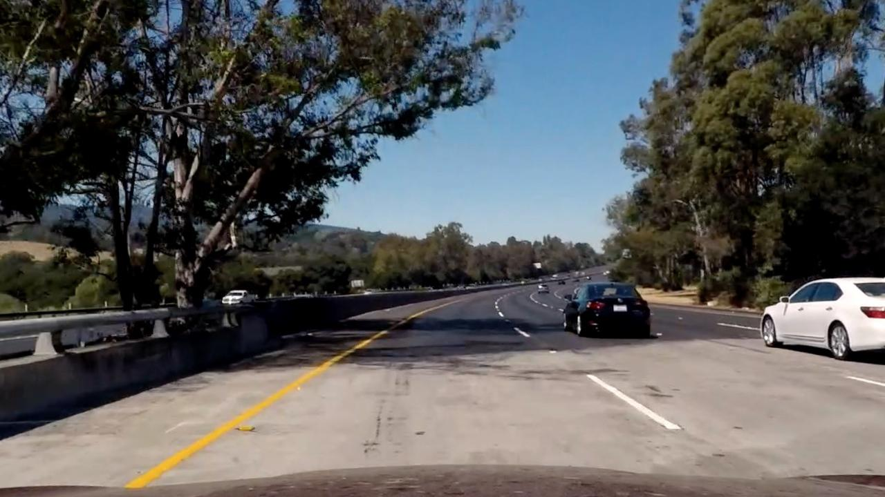
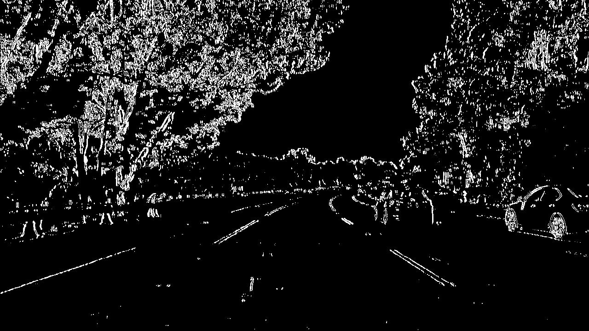
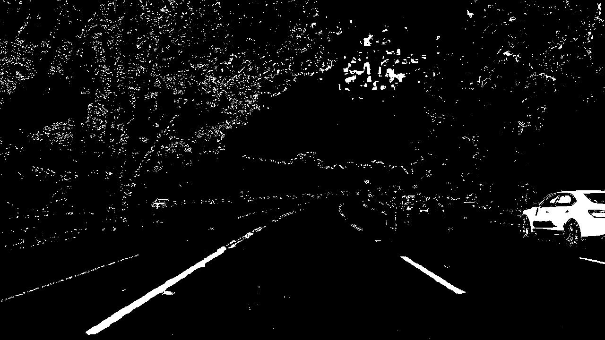
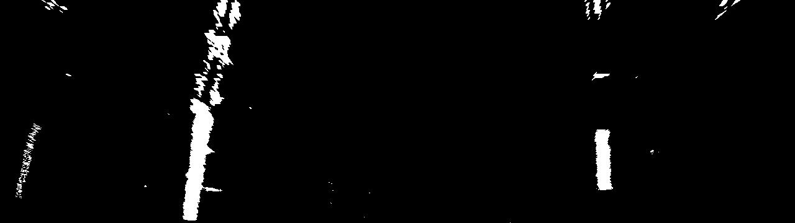

# Advanced Lane Finding Project

[//]: # (Image References)

[image2]: ./test_images/test1.jpg "Road Transformed"
[image4]: ./examples/warped_straight_lines.jpg "Warp Example"
[image5]: ./examples/color_fit_lines.jpg "Fit Visual"
[image6]: ./examples/example_output.jpg "Output"
[video1]: ./project_video.mp4 "Video"

In this project, we have used the advanced lane line detection algorithm to detect the lane line. When compared to the [Basic Lane Finding](https://github.com/KoushikBMS/koushik-lane-finding) which is used in the previous project, we have overcame many shortcomings like distortion due to camera, curving roads and environmental challenges like shadows, lighting, etc.

## Camera Calibration
---
We use camera for converting the real-world 3D image into 2D image. Lens are used in camera for capturing the light reflected from the real-world object get bend a little too much or too little at the edges of the lens, which results in the distortion of the image. Which can be categorized into two type **Radial** distortion and **Tangential** distortion.

To fix the distortion in the captured image we calculate the **camera calibration matrix** and **distortion coefficients** by using the Chessboard image which will be captured using the camera used for capturing the lane lines. In this project we use the chessboard images provided in the directory **camera_cal** for the camera calibration.

The computation of camera calibration matrix and distortion coefficients by using set of chessboard images in camera_cal is taken care in the file [CameraCalibration.ipynb](./CameraCalibration.ipynb). Briefly explained the same below, 

- Initially the number corners in the row and column of the chessboard is set. In our case it is 9 and 6 as per the used [chessboard image](./camera_cal/calibration2.jpg).
- Next the object point(**objpoints**) are prepared by using the known corners of the referred chessboard image(i.e. nx=9 and ny=6).
- Using the cv2 function **cv2.findChessboardCorners** the corners of the calibration image is calculated which is called image point(**imgpoints**). Calibration images where the corner is found is used for camera calibration.
- By using cv2 function **cv2.calibrateCamera** the camera calibration matrix and distortion coefficients is calculated which takes **objpoints** and **imgpoints** as the input. 
- The calculated **camera calibration matrix** and **distortion coefficients** is stored as **CameraCalibrationData.p** pickle file which is used for undistorting the raw image.

Below is a reference undistorted image by using the calculated camera calibration matrix and distortion coefficients

Original chessboard image| undistorted chessboard image
:---:|:---:
  |  

## Pipeline
The images in folder [test_images](./test_images) and [project_video.mp4](./project_video.mp4) are processed using the Advanced Lane line detection pipeline. The results are stored in [output_images](./output_images) and [project_video_output.mp4](./project_video_output.mp4) respectively. The advanced lane line detection is taken care in the file [AdvancedLaneFinding.ipynb](./AdvancedLaneFinding.ipynb). Below I have explained the different process which has been carried out on the image and video for detecting the Lane Lines.

### 1. Correcting Image Distortion

The image distortion correction is implemented in the function **undistortImage** which will take the Raw image as input and returns the undistorted image.
-  The **camera calibration matrix** and **distortion coefficients** is read from the pickle file **CameraCalibrationData.p** using function pickle.load().
- using the values read from the pickle file the image distortion is corrected by using cv2 function cv2.undistort() which takes the Raw image, camera calibration matrix and distortion coefficients as input.

Original image| Undistorted image
:---:|:---:
  |  

### 2. Gradient and Color Thresholding
I used a combination of color and gradient thresholds to filter out the unwanted pixels from the image and generate the binary image.

The gradient and color thresholding are implemented in the class **ColourAndGradient**. Initially an object for the class ColourAndGradient is created which takes undistorted image as input. The gradient and color thresholding is implemented in the function **ApplyColourAndGradient()**

As part of the class ColourAndGradient init the below mentioned operations executed,
- The undistorted image is stored in the class variable over which the threshold will be applied.
- The image is converted to HLS color space and the H,L,S channels are separated for applying the color thresholding
- All the thresholding limits are set in the init in separate variables
- sobel for x and y orientation is calculated which will be used for the gradient filtering

Below I have explained in detail the gradient and color thresholding which has been applied over the undistorted image

#### **Gradient Thresholding**
I have used a combination of gradient of X component, gradient of Y component, magnitude of gradient and direction of gradient for gradient thresholding. Explained each of the gradient filtering below in detail

- The gradient of x and y orientation is calculated in the function **grad_threshold** which take the orientation as input.
  - Based on input orientation first the absolute value of the sobel X or Y gradient is calculated
  - Next the absolute value image is converted into an 8-bit value
  - over the 8-bit converted binary image value thresholding is applied. If the threshold condition is satisfied, then pixel is set to 1
  - the value used for threshold is 20 > pixel value <= 100

  **Gradient of X image**
  

  **Gradient of Y image**
  

- Magnitude of gradient is calculated in the function **mag_threshold**
    - The magnitude of the gradient is calculated using the sobel X and Sobel Y values calculated in the class init.
    - next magnitude gradient image is converted into an 8-bit value image
    - over the 8-bit converted magnitude image value thresholding is applied. If the threshold condition is satisfied, then pixel is set to 1
    - the value used for magnitude threshold is 40 > pixel value <= 100
    
    **Magnitude of gradient image**
    

- Direction of gradient is calculated in the function **dir_threshold**
    - The absolute value of both sobel X and Y gradient is calculated 
    - The direction of the gradient is calculated by taking arctan of absolute value of sobel y and absolute value of sobel x 
    - over the direction image value thresholding is applied. If the threshold condition is satisfied, then pixel is set to 1
    - the value used for direction threshold is 0.6 > pixel value < 1.4
    
    **Direction of gradient image**
    

The gradient of X component, gradient of Y component, magnitude of gradient and direction of gradient is combined based the below mentioned equation

**Combined gradient => ((gradient of X component == 1) & (gradient of Y component == 1)) & ((magnitude of gradient == 1) & (direction of gradient == 1))**

If the combined equation is satisfied, then pixel is set to 1 which results in the combined gradient image.

**Gradient Binary Image**

#### Color Thresholding
Color thresholding is applied over individual H,L,S channel parameter to detect the lane lines properly.

H-Channel image| L-Channel image| S-Channel image
:---:|:---:|:---:
  |   | 

From the above image of the H,L,S channels we could see that the lane lines are proper detected in the L and S channels. But in the H channels the lane lines are not proper. So, I have used only the L and S channels for the lane line detection

The value used for the S channel threshold is pixel value > 115.If the threshold condition is satisfied then pixel is set to 1. If you check the below S channel Binary image the lane lines are getting detected properly. But the tree shadow is also getting detected over the Lane.

S-Channel image| S-Channel Binary Image
:---:|:---:
  |  

If you check the L channel Binary image, we could see that the shadow due to the tress is detected in Dark color. As like in S channel thresholding if the thresholding condition is satisfied then pixel value is set to 1. The value used for the L channel threshold is pixel value > 40.

L-Channel image| L-Channel Binary Image
:---:|:---:
  |  

As we could see S-Channel Binary image the shadow from the trees are getting detected, so discard the unwanted information from the detected image we combine the S-Channel binary image with the L-Channel binary image where the shadow due to the tree is detected in Dark color.

**S-Channel and L-Channel Combined Image**

As we could see from the above image the Shadows detected due to the tree is discarded only lane lines are present. To make the lane detection more robust we apply a second L channel threshold with the condition pixel > 200.

L-Channel image| L-Channel Binary Image2
:---:|:---:
  |  

As we could see from the above image the discontinued lane in right lane line which was not detected in the S and L channel combined is getting detected in the second L channel thresholding. So, we can combine all the thresholding to detect a proper Lane line.

So, by combining the S and L channel threshold we could arrive the final combined color equation,

Combined Color => ((S channel > S channel Threshold) & (L Channel > L Channel Threshold)) | ((L Channel > L Channel Threshold1))

If the combined Color equation is satisfied, then pixel is set to 1 which results in the combined Color image.

**Color Binary Image**

Finally, the Gradient Binary Image and Color Binary Image is combined which results in the below Binary Image.

**Binary Image**

from the above binary image, we could see that the lane line are detected even if the lanes are blocked by the shadow from the surrounding objects.

### 3. Perspective Transform
Perspective Transformation is applied on the detected binary image of the lane lines to get the birds-eye view of the lane lines.

The Perspective Transformation is implemented in function **perspectiveWarp** of the class **Wrap**. The source and destination points on the image is set in the init function of the Wrap class below provided the python code snippet of the source and destination points.

By using the above mentioned source and destination points the **transform matrix(M)** is calculated. It is calculated by using the cv2 function cv2.getPerspectiveTransform.

cv2 function **cv2.warpPerspective** is used for the perspective transformation to get the birds eye view of the lane lines. This function takes the transform matrix, binary image as the input.

Binary image| Wrapped image
:---:|:---:
  |  

### 4. Lane Line Detection, Radius of Curvature and Vehicle position Calculation
I have implemented of the Lane Line detected from the binary image and calculation of radius of curvature and vehicle position from the detected Lane lines in the function **fit_polynomial** of the class **DetectLaneAndCurvature**. 

Below I have explained in the details how the lane line are detected ,Radius of curvature calculation and Vehicle position calculation.

#### **i. Lane Line Detection**
>The lane line detection is implemented in the function **find_lane_pixels** of the class DetectLaneAndCurvature
>
>first the Histogram of the lower bottom of the wrapped image is calculated  
>
>Bottom Half Wrapped image| Histogram of image
>:---:|:---:
>  |  
>
>From the Histogram we could observe high value at the location lane lines.so the two peaks can be used as good indicators of the x-position of the base of the lane lines. so these points are used as the starting point for the searching the left and right lane lines separately.
>
>For detecting the lane line, I have used the **sliding window method**. we have set few hyperparameter for sliding window like number sliding window, width of the window and minimum number of pixel for recenter window. below i have attached a screenshot the value used for the hyperparameters,
>
>
>
>we split the image into 9 sections (i.e.nwindows times) and iterate the image from bottom to the top. The window height is calculated using nwindows.we use the starting point calculated from the histogram as the base value to search for the lane line in the bottom window of the image.
>
>The below steps are taken care in each window iteration,
>  - The Y min and Y max for the window is calculated by using the calculated  window height and window number
>  - next the boundaries of the lane line is calculated by using the margin and leftx and rightx value
>  - The lane lines are detected by calculating the non-zero pixels within the calculated boundaries. The non-zero pixels are calculated  because in the Gradient and Color Thresholding the detected edges are marked as 1.
>  - if the number of pixels you found in above step is greater than minpix hyperparameter, window is re-centered based on the mean position of the found non zero pixels.
>
>using the detected non-zero pixels form all the nwindows the leftx, lefty, rightx, righty position is calculated.
>
>Wrapped image| Detected Lane Line image
>:---:|:---:
>  |  
>
>by using the np.polyfit is the second order polynomial is calculated , which is used for generating the x and y values for plotting.

#### **ii. Radius of curvature**

>The **radius of curvature** is calculated using the below formula
>
>
>
>The radius of curvature is calculated in real-world space(i.e in meters).To convert from pixel space to real world space. meter per pixel is calculated for the x and y values using the below formula.
>
>**Meter per pixel in y-axis = 30 / pixels in y-axis** 
>
>**Meter per pixel in x-axis = 3.7 / pixels in x-axis** 
>
>In the above formula we have assumed that the lane is 30 meters long and 3.7 meter wide.
>
>In our case the pixel in y-axis is around 720 and pixel in x-axis is around 700.
>
>So **Meter per pixel in y-axis and Meter per pixel in x-axis** is multiplied to the corresponding pixel values for calculating the radius of curvature in meters.
>
>Since the radius of curvature value will large for a straight line,So if the value is greater than 4000 it is set as zero.

#### **iii. Vehicle position**
>The **vehicle position** is calculated using the below formula
>
>**Vehicle Position = ((left radius of curvature + (right radius of curvature - left radius of curvature))/2) - image midpoint**
>
>The left and right radius of curvature is calculated in pixel space, So the calculated  vehicle position will be in pixel space
>
>The Vehicle position is converted into the real-world space by using the Meter per pixel in x-axis.

The vehicle position is only calculated if the left and right radius of curvature is not equal to zero.

using the generated x and y values the Lane is drawn over the image. below is image of the detected lane
Wrapped image| Detected Lane image
:---:|:---:
  |  

### 5. Inverse Perspective Transform
Inverse Perspective Transformation is applied over the detected lane to get the Lane in the original Position.

The Inverse Perspective Transformation is implemented in function **perspectiveWarpInv** of the class **Wrap**. The source and destination points on the image is set in the init function of the Wrap class below provided the python code snippet of the source and destination points.

By using the above mentioned source and destination points the inverse transform matrix(M inverse) is calculated. It is calculated by using the cv2 function cv2.getPerspectiveTransform.

cv2 function cv2.warpPerspective is used for the perspective transformation to get the original view of the detected lane. This function takes the transform matrix, lane image as the input.

Detected Lane image| Unwrapped Lane image
:---:|:---:
  |  

	
### 6. Superimpose the Detected Lane, Vehicle Position and Radius of curvature

The Detected Lane is superimposed over the original image using the weighted_image function. In which the cv2.addWeighted function is used for superimposing the detected lane over the original image

over the above generated image the Vehicle Position, left and right radius of curvature using the function cv2.putText which takes the image, text and position as arguments 

Below is the output image and video link by applying the above pipeline

Output Image:

[Video Output](./project_video_output.mp4)

## **Potential Shortcomings**
---
* Since for every frame the lane line is searched blindly the above algorithm will not detect lane properly in sharp curves and tricky road conditions.

## **Possible improvements**
---
* We can search around using the previous image detected lane lines polynomial value to detect lane line in sharp curves and tricky road conditions.